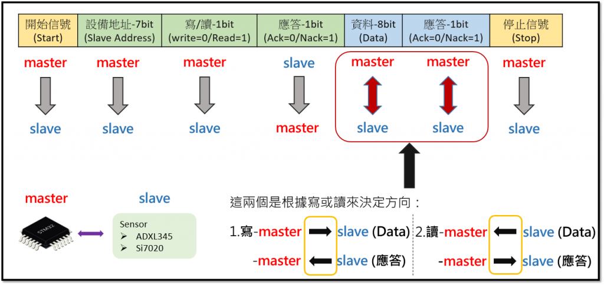

# Day 61: 電子五哥 & 品牌系統廠特訓 (三大硬體通訊協定 I2C, SPI, UART 深度剖析與除錯實戰)

今天是針對 Garmin、台達電、慧榮/建興儲存、研華/緯穎之「硬體實體通訊協定」特訓第一天。我們完整攻克了 I2C Open-Drain/上拉電阻與死鎖解鎖、SPI 4 種模式推導、以及 UART 16 倍過採樣與波特率誤差分頻算術。

---

## 🔍 1. I2C (Inter-Integrated Circuit) 深度硬體考點與除錯

### 📊 I2C 讀寫流程與主從傳輸方向圖解

#### 🔄 寫入 (Write) vs 讀取 (Read) 訊號傳輸方向對照：
1. **開始信號 (Start)**：由 **Master ➡️ Slave**（SCL 為高時，SDA 由高往下拉低）。
2. **設備地址 (7-bit Slave Address)**：由 **Master ➡️ Slave** 發送點名。
3. **讀寫位元 (1-bit R/W)**：由 **Master ➡️ Slave**（`0` 代表寫入 Write / `1` 代表讀取 Read）。
4. **設備應答 (1-bit ACK/NACK)**：由 **Slave ➡️ Master** 回覆（拉低為 ACK `0` / 沒拉低為 NACK `1`）。
5. **資料傳輸 (8-bit Data) 與 資料應答 (1-bit ACK/NACK)**：
   * **寫入模式 (Write = 0)**：
     * 資料 (Data)：**Master ➡️ Slave**
     * 應答 (ACK)：**Slave ➡️ Master**
   * **讀取模式 (Read = 1)**：
     * 資料 (Data)：**Slave ➡️ Master**
     * 應答 (ACK/NACK)：**Master ➡️ Slave**（Master 讀完最後一筆時故意發 NACK 告知結束）
6. **停止信號 (Stop)**：由 **Master ➡️ Slave**（SCL 為高時，SDA 由低往上拉高）。

---

### 1. Open-Drain (開漏輸出) 與 Pull-up (上拉電阻) 原理
* **硬體結構**：I2C 晶片引腳內部只有一個連到 GND 的 N-MOS 開關：
  * 輸出 `0` ➡️ N-MOS 導通，主動拉低接地 (0V / LOW)。
  * 輸出 `1` ➡️ N-MOS 斷開 (浮空 High-Z)，晶片自己無法主動輸出高電位，必須靠外部上拉電阻 (Pull-up Resistor, 4.7kΩ 或 2.2kΩ) 接到 VCC (3.3V/5V) 拉高。
* **線與 (Wired-AND) 防燒毀特性**：多個設備掛在同一條 SDA/SCL 總線上，即使同時輸出也不會發生電源短路。
* **電阻大小考量**：
  * 電阻過大 (如 10kΩ)：省電，但 RC 充放電時間長，訊號上升時間 ($t_r$) 變慢，在 400kHz 高速模式方波會變圓弧三角波導致資料讀取失敗。
  * 電阻過小 (如 1kΩ~2.2kΩ)：上升時間快、波形方正，支援更高速度，但拉低時耗電稍大。

### 2. ACK (0V) vs NACK (5V) 判定
* **ACK (0V)**：接收端在第 9 個 Clock 主動將 SDA 拉低到 0V（代表收到該 Byte）。
* **NACK (5V)**：SDA 保持在高電位 5V（無人拉低）。
  * 原因 1：**軟體 Slave 位址寫錯**（總線上無人認領，最常見！）。
  * 原因 2：**硬體斷線或沒供電**（Slave 晶片沒開機）。
  * 原因 3：**Slave 設備忙碌中**（如 EEPROM 內部正在寫入）。
  * 原因 4：**Master 讀取結束**（Master 故意發 NACK 告知 Slave 停止傳輸）。

### 3. 💥 I2C 總線死鎖 (SDA 卡死 0V) 與「9-Clock 軟體解鎖 SOP」
* **死鎖原因**：Master 讀取 Slave 途中突然當機或 Reset，而 Slave 剛好把 SDA 拉低在輸出 bit `0`。Master 重開機後想送 Start 訊號，但因 SDA 被 Slave 死死拉低在 0V，導致整條總線永久卡死。
* **軟體 9-Clock 解鎖步驟**：
  1. Master 將 SCL 引腳切換成一般 GPIO 輸出模式。
  2. Master 用軟體手動連續產生 **9 個 SCL 時鐘脈衝 (方波)**。
  3. Slave 以為 Master 在繼續讀取，吐完 8 bits 後在第 9 個 Clock 沒收到 ACK，**自動釋放 SDA 引腳（SDA 被上拉電阻拉回高電位）！**
  4. Master 送出一個標準的 **STOP Condition**，總線滿血復活！

---

## ⚡ 2. SPI (Serial Peripheral Interface) 4 種模式與時序判讀

### 1. 4 條訊號線與全雙工特性
* `SCK` (時鐘由 Master 提供)、`MOSI` (主出從入)、`MISO` (主入從出)、`CS / SS` (片選線，通常低電位有效 Active-LOW)。
* **多設備並聯**：`SCK`, `MOSI`, `MISO` 全部並聯接在同一組線；MCU 為每顆設備獨立拉一條 `CS` 線，拉低哪一條就跟哪一顆設備講話。

### 2. CPOL (時鐘極性) 與 CPHA (時鐘相位) 推導法
* **CPOL (Clock Polarity)**：平時沒傳資料時 SCK 的閒置電位。
  * `CPOL = 0` ➡️ 閒置為 **低電位 (0V)**（第 1 緣為上升緣，第 2 緣為下降緣）。
  * `CPOL = 1` ➡️ 閒置為 **高電位 (3.3V)**（第 1 緣為下降緣，第 2 緣為上升緣）。
* **CPHA (Clock Phase)**：在第幾個邊緣進行資料採樣。
  * `CPHA = 0` ➡️ 在 **第 1 個邊緣** 採樣。
  * `CPHA = 1` ➡️ 在 **第 2 個邊緣** 採樣。

| 模式 | CPOL | CPHA | 採樣邊緣 (Sample Edge) | 常用場景 |
| :--- | :--- | :--- | :--- | :--- |
| **Mode 0** | `0` (低) | `0` (第 1 緣) | **上升緣 (Rising Edge)** | SD 卡、感測器最常用 |
| **Mode 1** | `0` (低) | `1` (第 2 緣) | **下降緣 (Falling Edge)** | 部分專用晶片 |
| **Mode 2** | `1` (高) | `0` (第 1 緣) | **下降緣 (Falling Edge)** | 部分通訊晶片 |
| **Mode 3** | `1` (高) | `1` (第 2 緣) | **上升緣 (Rising Edge)** | SPI Flash 晶片最常用 |

---

## ⏱️ 3. UART 傳輸耗時與 16 倍過採樣分頻算術

### 1. 傳輸耗時計算 (標準 8N1 格式)
* **每傳送 1 個 Byte 需發送 10 個 Bits** (1 Start + 8 Data + 0 Parity + 1 Stop)。
* **1 Byte 傳輸時間**：$$\frac{10}{\text{Baud Rate (bps)}}$$
  * 例如 115200 bps：$\frac{10}{115200} \approx 86.8\mu s$。
  * 傳送 1152 Bytes 封包：$$\frac{1152 \times 10}{115200} = \mathbf{100\text{ ms}}$$。

### 2. 16 倍過採樣 (16x Oversampling) 與分頻係數 $N$
* **為什麼在第 7, 8, 9 格 (50% 正中央) 採樣？**：避開訊號剛跳變時的邊緣干擾與雜訊，在電位最穩定的中央進行 3 次多數決投票採樣。
* **硬體分頻公式**：$$N = \frac{f_{osc}}{16 \times \text{Baud Rate}}$$
* **為什麼需要 11.0592 MHz / 7.3728 MHz 魔法晶振？**：
  * 硬體計數器只能存整數 $N$。
  * 若用 12 MHz 晶振，算 115200 bps 的分頻係數為 $6.5104$，迫使硬體四捨五入成 7（誤差 $-7.0\%$）或 6（誤差 $+8.5\%$），誤差大於 3% 累積到第 8、9 個 Bit 時會直接跑偏產生嚴重亂碼！
  * 若用 11.0592 MHz 晶振，分頻係數剛好是完美整數 $N = 6$，達到 **$0.00\%$ 零誤差率**！
