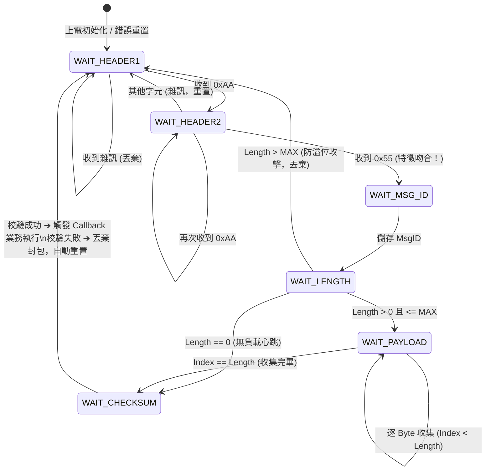

# 🛰️ 雙核心二進位幀通訊協定與狀態機解析器實作指南 (Binary Protocol & FSM Parser)

> **適用架構**：樹莓派 4B (64-bit ARM Linux / Python / C++) $\longleftrightarrow$ Arduino Uno (8-bit AVR / C)  
> **核心目標**：徹底消除字串解析開銷、免疫馬達碳刷換向 EMI 干擾引發之封包撕裂、解決跨平台結構體對齊 (Padding) 大雷。

---

## 📌 一、 為什麼工業界不用字串傳輸？（痛點與對比）

很多學校專案或初學者在實作 UART 序列埠通訊時，習慣傳送 ASCII 字串（例如 `"SPEED:200,240\n"` 或單一字元 `'F'`）：

| 評估維度 | 傳統 ASCII 字串傳輸 (`"SPEED:200,240\n"`) | 工業界二進位二元封包 (`Binary Packet`) |
| :--- | :--- | :--- |
| **傳輸頻寬與延遲** | 長度高達 16 Bytes，在 9600 鮑率下傳輸耗時 **16.6 ms** | 同樣指令僅需 **9 Bytes**，在 115200 鮑率下僅需 **0.78 ms (快 21 倍！)** |
| **CPU 解析開銷** | MCU 必須呼叫 `sscanf()` 或 `atoi()`，字串轉整數耗費上千個 CPU 週期 | **零拷貝直接指標轉型**：`const MotionPayload_t* p = (MotionPayload_t*)payload` (1 個時脈週期！) |
| **抗電磁干擾 (EMI)** | 馬達火花造成 1 Byte 雜訊（如 `"PEED:..."`），字串解析器直接當機丟包 | **0xAA 0x55 同步頭 + 狀態機**，遇到雜訊自動重置對齊，下一幀立即恢復！ |
| **資料校驗能力** | 無校驗碼或單純靠結尾換行符 `\n`，數值被雜訊篡改無法察覺 | **帶有 XOR / CRC-16 校驗和**，若數值受干擾被竄改立即被丟棄，杜絕暴衝！ |

---

## 📦 二、 工業級二進位封包格式 (Packet Layout)

本專案採用的標準二進位封包結構如下：

```
┌───────┬───────┬─────────┬────────────┬────────────────────────┬──────────┐
│ 0xAA  │ 0x55  │ MsgID   │ Length (N) │   Payload (N Bytes)    │ Checksum │
├───────┼───────┼─────────┼────────────┼────────────────────────┼──────────┤
│ 1 B   │ 1 B   │ 1 Byte  │ 1 Byte     │ 0 ~ 32 Bytes           │ 1 Byte   │
└───────┴───────┴─────────┴────────────┴────────────────────────┴──────────┘
```

1. **同步特徵碼 (Sync Header, `0xAA 0x55`)**：  
   在二進位中，`0xAA = 10101010b`，`0x55 = 01010101b`。這兩個位元交錯的高頻信號在示波器上極具特徵，硬體接收端能極高可靠度地過濾隨機白雜訊。
2. **指令類型 (MsgID)**：  
   `0x01` (心跳), `0x02` (差速運動指令), `0x03` (刺氣球舵機指令), `0x04` (緊急煞車), `0x81` (Arduino 遙測回報)。
3. **資料長度 (Length)**：  
   動態長度設計，防禦緩衝區溢位（超過最大長度即判定異常）。
4. **有效載荷 (Payload)**：  
   以嚴格 **小端序 (Little-Endian)** 與 **1-Byte 對齊 (`#pragma pack(1)`)** 存放的二進位數值。
5. **校驗和 (Checksum)**：  
   `MsgID ^ Length ^ Payload[0] ^ ... ^ Payload[N-1]`。

---

## 🔄 三、 有限狀態機解析器 (FSM State Machine)

接收端不應使用阻塞式的 `Serial.readBytesUntil('\n')`，而是使用**非阻塞的有限狀態機（FSM）**，每從硬體 FIFO 收到 1 個 Byte 就餵入狀態機：



---

## 💻 四、 專案代碼位置與使用方式

本模組已完整新增於你的 `car/protocol/` 目錄中：

### 1. 通用協議標頭檔：[`car/protocol/packet_protocol.h`](file:///c:/Users/a0907/Desktop/程式訓練/car/protocol/packet_protocol.h)
* 定義了 MsgID 列舉與 `#pragma pack(push, 1)` 封裝的 `MotionPayload_t`、`AttackPayload_t`、`TelemetryPayload_t`。

### 2. 狀態機核心解析器：[`car/protocol/fsm_parser.h`](file:///c:/Users/a0907/Desktop/程式訓練/car/protocol/fsm_parser.h) / [`.c`](file:///c:/Users/a0907/Desktop/程式訓練/car/protocol/fsm_parser.c)
* 包含 `FsmParser_Init()` 與 `FsmParser_FeedByte()`，支援零記憶體配置的狀態流轉與回呼函式機制。

### 3. Arduino 端接收範例：[`car/protocol/arduino_binary_receiver_demo.ino`](file:///c:/Users/a0907/Desktop/程式訓練/car/protocol/arduino_binary_receiver_demo.ino)
* 展示如何在 `loop()` 中將序列埠字元非阻塞丟入狀態機，並在收到 `MSG_ID_MOTION_CMD` 時瞬間透過結構體指標驅動馬達。

### 4. 樹莓派端發送範例：[`car/protocol/rpi_binary_sender_demo.py`](file:///c:/Users/a0907/Desktop/程式訓練/car/protocol/rpi_binary_sender_demo.py)
* 展示 Python 如何使用 `struct.pack('<BBBBhhB', ...)` 封裝出合法十六進位封包。
* **前進運動封包範例**：
  ```text
  AA 55 02 04 C8 00 F0 00 3E
  ├──┘  │  │  └──┬──┘ └──┬──┘ │
  Header ID Len 左輪:200 右輪:240 Checksum
  ```

---

## 🎯 五、 技術面試滿分應答劇本

> **面試官**：「你在自走車專案中，上位機（Linux/樹莓派）與下位機（MCU）的通訊協定是怎麼設計的？」
> 
> **回答亮點**：  
> 「我們摒棄了傳統學生專題常用的 ASCII 字串與 `atoi/sscanf` 解析，採用了**工業級自定義二進位幀協議（Binary Frame Protocol）**：
> 1. **封包抗干擾設計**：每包以 `0xAA 0x55` 雙同步前導碼開頭，配合長度與 XOR 校驗和。即使馬達啟動瞬間的 EMI 雜訊導致 UART 出現毛刺或丟包，也能被校驗和精確攔截，絕不誤動作。
> 2. **有限狀態機（FSM）接收器**：在 Arduino 端使用非阻塞狀態機逐 Byte 推進，發生位移時會在下一個 `0xAA 0x55` 出現時自動重新對齊（Resynchronization），杜絕序列埠死鎖。
> 3. **跨平台記憶體對齊防護**：樹莓派（64-bit ARM）與 Arduino（8-bit AVR）的資料對齊規則不同。我們在 C 語言結構體中使用 `#pragma pack(push, 1)`，並在 Python 端嚴格指定 `<`（Little-Endian）打包，徹底消除跨晶片 Padding 位移所引發的數值錯亂陷阱！」
