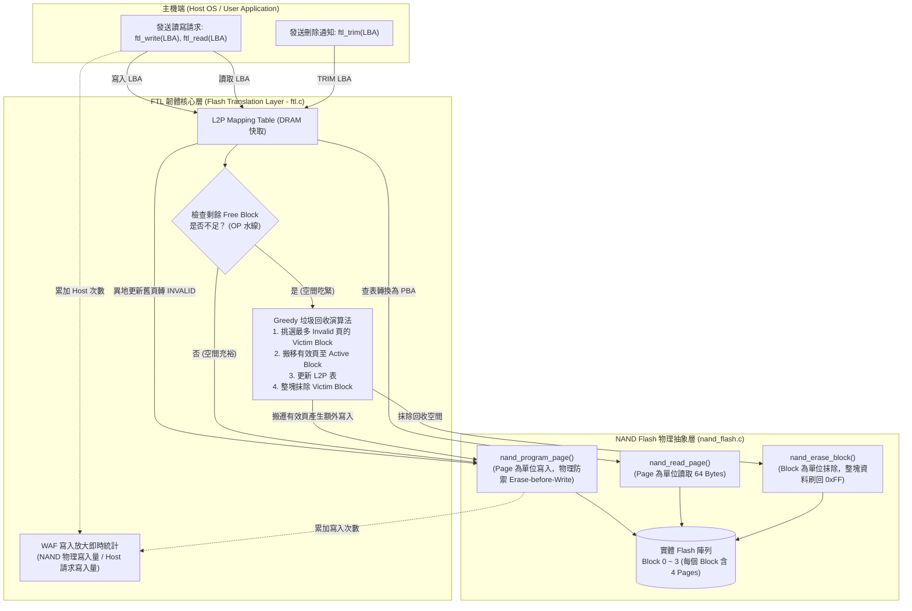

# Mini FTL (Flash Translation Layer) 固態硬碟主控韌體模擬器

[](https://en.wikipedia.org/wiki/C99)
[]()
[](https://youtu.be/JwYttFnXRps?si=6mdgYg3KnAlv9Oke)

本專案是一個專為 **儲存控制晶片廠（群聯 Phison、慧榮 SMI、聯詠 Novatek、瑞昱 Realtek）韌體工程師（FW/Algorithm）技術面試** 所打造的純 C 語言迷你固態硬碟主控模擬器。

核心設計以深度科普頻道 **Tech With Nikola** 的經典名片 [《What's Actually Happening Inside Your SSD?》](https://youtu.be/JwYttFnXRps?si=6mdgYg3KnAlv9Oke) 為藍本，將影片中介紹的 **NAND 物理限制、Page/Block 階層、異地更新（Out-of-place Update）、L2P 映射表、Greedy 垃圾回收（GC）、TRIM 指令與寫入放大（WAF）** 轉化為可實際編譯、執行的 C 語言資料結構與韌體演算法。

---

## 📺 影片章節 (Video Parts) 與程式碼對應架構

本模擬器的每一個資料結構與函式，均與影片各 Part 深入探討的硬體行為 1:1 完美呼應：

| 影片章節 (Timestamp) | 探討核心主題 | 程式碼對應位置 | 關鍵實作與硬體行為 |
| :--- | :--- | :--- | :--- |
| **[0:20] Hard disk drives vs SSDs** | HDD 尋軌延遲 vs SSD 純電子固態電路特性 | [`nand_flash.h`](./nand_flash.h) | 定義微縮版 SSD 規格：4 Blocks $\times$ 4 Pages (共 16 物理頁) |
| **[1:00] Inside the SSD: controller, DRAM, NAND** | SSD 三大核心元件：主控晶片、DRAM 快取、NAND 顆粒 | [`nand_flash.c`](./nand_flash.c)<br>[`ftl.c`](./ftl.c) | `flash_blocks[]` (NAND 陣列)、`l2p_table[]` (DRAM 快取)、FTL 韌體函式 |
| **[2:31] How NAND stores a bit** | 浮動閘極/電荷捕捉、穿隧效應、抹寫壽命損耗 | [`nand_flash.h`](./nand_flash.h) | `erase_count` 抹寫次數統計、`PAGE_FREE` / `VALID` / `INVALID` 狀態機 |
| **[4:29] Pages and blocks: the rules of NAND** | 讀寫以 Page 為單位、抹除以 Block 為單位、**Erase-before-Write** | [`nand_flash.c`](./nand_flash.c) | `nand_program_page()` 嚴禁覆寫非 FREE 頁面；`nand_erase_block()` 整塊抹除重置為 `0xFF` |
| **[7:01] The update problem** | 覆寫難題：NAND 無法原地覆寫，只能異地更新 | [`ftl.c`](./ftl.c) | `ftl_write()` 將舊實體 Page 標記為 `PAGE_INVALID`，新資料寫入全新 Free Page |
| **[8:20] Flash Translation Layer (FTL)** | LBA 邏輯位址對映 PBA 實體位址（L2P Table） | [`ftl.c`](./ftl.c) | `l2p_table[]` 動態位址轉換；`ftl_read()` 反查實體頁；`ftl_write()` 更新映射 |
| **[10:20] Garbage collection & WAF** | 空間不足時挑選受害者區塊、搬遷有效頁、抹除區塊 | [`ftl.c`](./ftl.c) | `ftl_trigger_gc()` (Greedy 挑選最多垃圾之區塊、搬遷有效頁、更新 L2P、抹除 Block、計算 WAF) |
| **[12:18] Wear leveling and TRIM** | 抹損均衡與作業系統 TRIM 刪除通知 | [`ftl.c`](./ftl.c) | `ftl_trim()` 主機通知刪除檔案，FTL 直接標記 `INVALID` 免去 GC 搬移負擔 |
| **[14:27] SLC, MLC, TLC, QLC explained** | 顆粒技術演進與耐用度權衡 | [`nand_flash.h`](./nand_flash.h) | 預留空間 (Over-Provisioning) 與水線保護閾值設定 |
| **[15:40] Practical takeaways** | 保留 OP 空間、避免 SSD 寫滿掉速 | [`ftl.c`](./ftl.c) | 實體 16 Pages vs 邏輯 8 LBAs (50% OP 空間)，`count_free_blocks() <= 1` 自動引發 GC |

---

## 🏗️ 系統架構圖 (System Architecture)



---

## 🔬 各章節細節與程式碼深入剖析

### 1. NAND 物理特性與限制 ([4:29] Pages and blocks)
* **讀寫以 Page 為單位**：真實 NAND 讀取與寫入是以 Page（4KB ~ 16KB）為基礎。本專案以 `PAGE_DATA_SIZE = 64 Bytes` 模擬。
* **抹除以 Block 為單位**：數十或數百個 Pages 組成一個 Block。**NAND 物理上無法單獨抹除一個 Page**。
* **Erase-before-Write 鐵律**：
  在 [`nand_flash.c`](./nand_flash.c) 中，硬體防護若發現目標 Page 不是 `PAGE_FREE`，會直接拒絕寫入：
  ```c
  if (flash_blocks[block].pages[page].state != PAGE_FREE) {
      printf("[NAND ERROR] 試圖覆寫非 FREE 狀態的 Page！違反 NAND 物理特性！\n");
      return false;
  }
  ```

---

### 2. 異地更新與 L2P 映射 ([7:01] Update Problem & [8:20] FTL)
* 當作業系統修改檔案時（覆寫同一個 LBA），SSD 不能覆蓋原位置，必須採用 **Out-of-place Update（異地更新）**：
  1. 將舊實體位置標記為 `PAGE_INVALID`（作廢）。
  2. 將新資料寫入目前的活躍空白頁（`active_block, active_page`）。
  3. 更新 DRAM 中的 `l2p_table[lba]` 指向新實體頁。

```c
// 節錄自 ftl.c -> ftl_write()
if (l2p_table[lba].block != -1) {
    uint32_t old_b = (uint32_t)l2p_table[lba].block;
    uint32_t old_p = (uint32_t)l2p_table[lba].page;
    nand_set_page_state(old_b, old_p, PAGE_INVALID); // 舊實體位置作廢
}
nand_program_page(active_block, active_page, data, lba);
l2p_table[lba].block = active_block;
l2p_table[lba].page = active_page;
```

---

### 3. 垃圾回收與寫入放大 ([10:20] Garbage Collection & WAF)
* **Greedy 垃圾回收策略**：
  當剩餘空白區塊不足（`count_free_blocks() <= 1`）時，自動觸發 GC：
  1. **Victim Selection**：掃描所有非活躍區塊，找出 `PAGE_INVALID` 最多的區塊作為受害者（Victim）。
  2. **Valid Page Relocation**：將受害者區塊內剩餘的有效頁（`PAGE_VALID`）讀出，並重新寫入到新的空白區塊，同時更新 L2P 映射表。
  3. **Block Erase**：將受害者區塊整塊抹除，重置為全新 `PAGE_FREE` 區塊。
* **寫入放大（WAF, Write Amplification Factor）**：
  $$\text{WAF} = \frac{\text{實際寫入 NAND 的 Page 數（Host 寫入 + GC 搬遷）}}{\text{主機端請求寫入的 Page 數}}$$
  GC 搬遷的有效頁越多，WAF 越高，SSD 壽命耗損越快。

---

### 4. TRIM 指令機制 ([12:18] Wear leveling and TRIM)
* 作業系統刪除檔案時，若未發送 TRIM，SSD 主控並不知道資料已被刪除。在 GC 時，FTL 仍會「傻傻地」將已被刪除的有效頁搬遷至新區塊，造成嚴重的寫入放大。
* **TRIM 支援**：
  當主機呼叫 `ftl_trim(lba)`，FTL 直接將對應實體頁改為 `PAGE_INVALID` 並解除映射。下次 GC 挑到該區塊時，直接抹除，省去搬遷開銷！

```c
// 節錄自 ftl.c -> ftl_trim()
if (l2p_table[lba].block != -1) {
    nand_set_page_state(l2p_table[lba].block, l2p_table[lba].page, PAGE_INVALID);
    l2p_table[lba].block = -1;
    l2p_table[lba].page = -1;
    return true;
}
```

---

## 🚀 編譯與執行展示 (How to Build & Run)

### 1. 編譯 (GCC / Clang / MSVC)
```bash
# 使用 GCC 編譯
gcc -std=c99 -Wall -Wextra main.c ftl.c nand_flash.c -o ftl_sim

# 或使用 Windows MSVC 編譯
cl /utf-8 /nologo /W4 main.c ftl.c nand_flash.c /Fe:ftl_sim.exe
```

### 2. 執行
```bash
./ftl_sim
```

### 3. 測試生命週期與輸出展示
執行時將依序展示 SSD 完整的五大工作週期：
1. **階段 1：循序寫入 LBA 0 ~ 7**（填滿 8 個邏輯磁區，展示 Block 0、Block 1 填入 `[V:L00]` ~ `[V:L07]`）。
2. **階段 2：隨機覆寫 LBA 0, 1, 2**（展示 Out-of-place Update，舊頁面自動轉為 `[I:L00]` ~ `[I:L02]` 無效垃圾頁）。
3. **階段 3：空間耗盡，自動觸發 Greedy GC**（鎖定垃圾最多的 Block 0，搬遷剩餘有效頁至新區塊，整塊抹除 Block 0）。
4. **階段 4：全域資料完整性校驗（Read Verification）**（讀取 LBA 0 ~ 7，驗證歷經 GC 搬遷後資料依然 100% 正確）。
5. **階段 5：TRIM 指令演示與 WAF 報告**（執行 TRIM 釋放空間，印出主機寫入 vs NAND 寫入次數與最終 WAF）。

---

## 🎙️ 儲存晶片廠（群聯/慧榮/聯詠/瑞昱）面試核心 Q&A

> **Q1：請說明 NAND Flash 為什麼需要 FTL？不能直接讓 OS 像存取 RAM/HDD 一樣寫入嗎？**  
> **Ans**：因為 NAND Flash 具有三大嚴苛物理限制：
> 1. **Erase-before-Write**：Page 寫入前必須先抹除，抹除後為 1，寫入只能將 1 改為 0。
> 2. **讀寫以 Page 為單位，抹除以 Block 為單位**：兩者顆粒度不對稱，無法直接覆寫舊資料。
> 3. **有限的抹寫壽命（P/E Cycles）**：需要 Wear Leveling 平均分散磨損。  
> 因此必須透過 FTL 在中間做邏輯（LBA）到實體（PBA）的動態映射轉換。

> **Q2：什麼是寫入放大（WAF）？GC 策略如何影響 WAF？**  
> **Ans**：WAF 是實際寫入 NAND 的資料量與主機要求寫入資料量的比值。在 GC 過程中，如果被挑選的 Victim Block 內含有許多「有效頁」，控制器就必須把這些有效頁複製搬遷到新區塊，這些額外的寫入就是 WAF 大於 1 的主要原因。透過 Greedy 策略挑選無效頁最多的區塊、以及保留足夠的 Over-Provisioning（OP）空間與支援 TRIM，能有效壓低 WAF。

> **Q3：TRIM 命令在 FTL 內部具體發揮了什麼功用？**  
> **Ans**：當 OS 刪除檔案時，傳統檔案系統只清除了元數據（Metadata），SSD 硬體無法得知該空間已無用。TRIM 命令由 OS 主動下發，告知 FTL 哪些 LBA 已經無效。FTL 收到後將對應的實體 Page 直接標記為 `PAGE_INVALID`。當後續觸發 GC 時，控制器就可以直接將該頁丟棄而不必搬遷，大幅減少無謂的 NAND 寫入並降低 WAF。

---

## 📄 專案目錄結構
```
.
├── README.md           # 專案詳細架構、影片對照、編譯說明與面試 Q&A
├── nand_flash.h        # NAND Flash 物理層結構與狀態機定義 (Block/Page/PageState)
├── nand_flash.c        # NAND Flash 物理層實作 (Erase-before-Write 防禦、佈局輸出)
├── ftl.h               # FTL 轉換層 API (L2P 對映、GC、TRIM、WAF 統計)
├── ftl.c               # FTL 核心演算法實作 (Greedy GC、異地更新、位址轉換)
├── main.c              # 完整 SSD 生命週期測試展示驅動
└── .gitignore          # 忽略編譯產物
```
